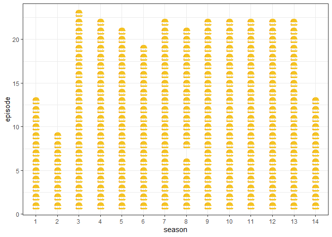
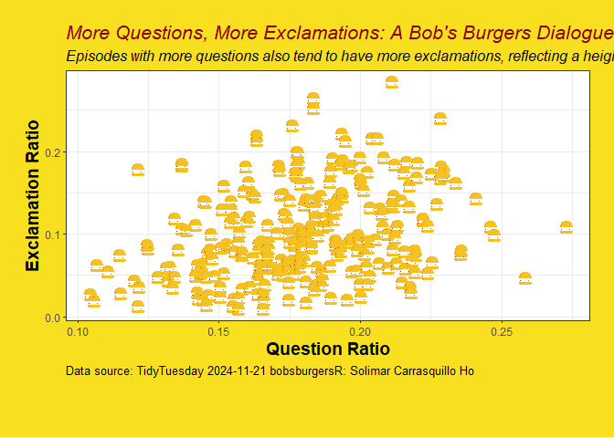
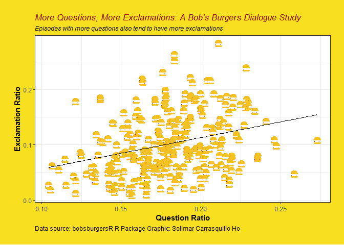

TT_4
================
Solimar Carrasquillo Ho
2024-11-19

### load up the libraries

### This week we’re going to be working with a Bob’s Burger dataset!!

``` r
bob <- readr::read_csv('https://raw.githubusercontent.com/rfordatascience/tidytuesday/master/data/2024/2024-11-19/episode_metrics.csv')
```

    ## Rows: 272 Columns: 8
    ## ── Column specification ────────────────────────────────────────────────────────
    ## Delimiter: ","
    ## dbl (8): season, episode, dialogue_density, avg_length, sentiment_variance, ...
    ## 
    ## ℹ Use `spec()` to retrieve the full column specification for this data.
    ## ℹ Specify the column types or set `show_col_types = FALSE` to quiet this message.

``` r
View(bob)
```

### Other things that could be fun to challenge myself….changing more of the background to look professional…

Were going to be using the package ggsvg and a couple of others to try
and add a custom image to our graph. Let’s try to add a simple picture
from the SVG online repo. This was actually way harder to trouble shoot!

``` r
svg_url <- "https://www.svgrepo.com/download/505202/hamburger.svg"
svg_txt <- paste(readLines(svg_url), collapse = "\n")
```

    ## Warning in readLines(svg_url): incomplete final line found on
    ## 'https://www.svgrepo.com/download/505202/hamburger.svg'

# Data manipulation

``` r
burgers <- bob %>% 
   mutate(season = as.factor(season)) 
```

Let’s start plotting now.

make a simple plot with hamburger to troubleshoot the svg image.

``` r
ggplot(burgers) + 
  geom_point_svg(aes(season, episode), svg = svg_txt, size = 4) + 
  theme_bw()
```

<!-- -->

make it fancy n cute :)

``` r
ggplot(burgers) +
  geom_point_svg(aes(question_ratio, exclamation_ratio), svg = svg_txt, size = 4) +
  labs(
    x = "Question Ratio", 
    y = "Exclamation Ratio", 
    title = "More Questions, More Exclamations: A Bob's Burgers Dialogue Study",
    subtitle = "Episodes with more questions also tend to have more exclamations, reflecting a heightened conversational or emotional tone.",
    caption = "Data source: TidyTuesday 2024-11-21 bobsburgersR: Solimar Carrasquillo Ho"
  ) +
  theme_bw() +
  theme(
    axis.title.x = element_text(size = 14, color = "black", face = "bold"),  
    axis.title.y = element_text(size = 14, color = "black", face = "bold"),  
    plot.title = element_text(size = 16, color = "darkred", face = "italic"),
    plot.subtitle = element_text(size = 12, color = "black", face = "italic"),
    plot.caption = element_text(size = 10, color = "black", hjust = 0),
    plot.background = element_rect(fill = "#f8df20", color = NA),
    plot.margin = margin(20, 20, 50, 20)  # Adjust bottom margin for space
  ) +
  theme(
    # Allow for text wrapping in the caption
    plot.caption = element_text(lineheight = 1.2)  # Line height for wrapped caption text
  )
```

<!-- -->

# this is the final code to use

``` r
ggplot(burgers) +
  geom_point_svg(aes(question_ratio, exclamation_ratio), svg = svg_txt, size = 4) +
  geom_smooth(aes(x = question_ratio, y = exclamation_ratio), 
              method = "lm", 
              se = FALSE, 
              color = "black", 
              size = 0.5) +  # Linear regression line
  labs(
    x = "Question Ratio", 
    y = "Exclamation Ratio", 
    title = "More Questions, More Exclamations: A Bob's Burgers Dialogue Study", 
    subtitle = "Episodes with more questions also tend to have more exclamations",
    caption = "Data source: bobsburgersR R Package Graphic: Solimar Carrasquillo Ho"
  ) +
  theme_bw() +
  theme(
    axis.title.x = element_text(size = 11, color = "black", face = "bold"),  
    axis.title.y = element_text(size = 11, color = "black", face = "bold"),  
    plot.title = element_text(size = 13, color = "darkred", face = "italic"),
    plot.subtitle = element_text(size = 9, color = "black", face = "italic"),
    plot.caption = element_text(size = 9, color = "black", hjust = 0),
    plot.background = element_rect(fill = "#f8df20", color = NA),
    plot.margin = margin(20, 20, 20, 20)
  )
```

    ## Warning: Using `size` aesthetic for lines was deprecated in ggplot2 3.4.0.
    ## ℹ Please use `linewidth` instead.
    ## This warning is displayed once every 8 hours.
    ## Call `lifecycle::last_lifecycle_warnings()` to see where this warning was
    ## generated.

    ## `geom_smooth()` using formula = 'y ~ x'

<!-- -->
